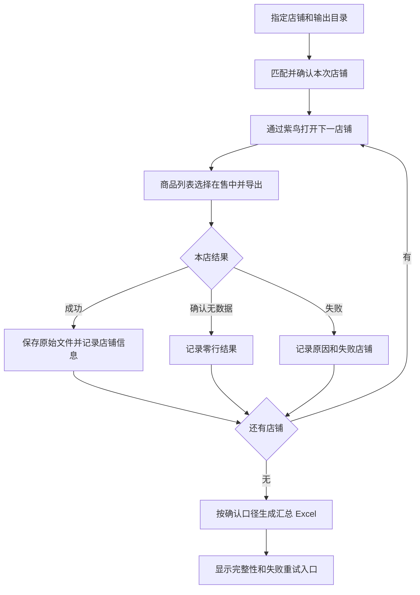

# TEMU 东南亚在售商品批量导出与汇总需求

| 项目 | 内容 |
| --- | --- |
| 需求方 | 袁晶 |
| 开发项目 | `D:\hqyl_project\hqyl_desktop`，寰球云联自动化桌面平台 |
| 整理日期 | 2026-09-15，北京时间 |
| 文档状态 | V1.0，业务口径于 17:56:29 确认，完整需求摘要于 17:59:10 获袁晶回复“好的” |
| 交付形态 | 桌面平台内新增业务功能，输出本地 Excel |
| 本次工作 | 需求沟通、样例检查和开发交接；尚未实现或实机验证导出功能 |

## 1. 目标与范围

运营人员自行指定一个或多个 TEMU 东南亚店铺。程序通过紫鸟打开对应店铺，进入“商品管理 → 商品列表 → 在售中”，下载查询结果，保留各店原始文件，并把选中店铺的数据汇总到一个 Excel。汇总表第一列为“店铺名”，逐行填写紫鸟中对应的店铺名称。

**最终数据口径：只按商品状态“在售中”确定范围；申报价格“已生效”和“已作废”全部保留，不额外筛选国家或经营站点。自定义选店是首版必需功能。**

本期聚焦“在售商品导出与汇总”。已确认不需要定时运行。其他程序需求、商品修改、调价、库存修改及上下架操作均不属于本功能。

## 2. 需求确认记录

下列记录来自杨玉林与袁晶的钉钉单聊，时间均为 2026-09-15。聊天证据只保留与本功能有关的结论。

| 时间 | 袁晶的确认 / 提出内容 | 对应结论 |
| --- | --- | --- |
| 17:36:38 | “商品管理-商品列表-点击在售中，下载查询结果” | 以平台“在售中”查询导出为数据源 |
| 17:37:41 | “若下载多个店铺，需要汇总到一起，表头在前面加一个店铺名” | 多店合并；店铺名位于第一列 |
| 17:42:45 | “temu东南亚的店铺都需要……可手动选择的店铺，就像流量加速器一样” | 支持 TEMU 东南亚店铺，运行范围由运营自主选择 |
| 17:42:52 | “店铺是在紫鸟打开” | 使用紫鸟店铺会话 |
| 17:46:41 | 对“店铺名用紫鸟里的店铺名称”回复“对” | 店铺名称取自紫鸟 |
| 17:46:41 | 对“手动选店、生成汇总 Excel、同时保留单店原文件”回复“可以，不需要定时运行，需要我们自己能挑店铺下载” | 手动触发；保留汇总和原始文件；不加调度器 |
| 17:46:41 | 对“失败继续其他店，最后列出失败店铺供重试”回复“可以” | 单店失败不终止整批，提供失败项重试 |
| 17:56:29 | “已生效和已作废全部保留” | 不按申报价格状态过滤任何在售行 |
| 17:56:29 | “只选择店铺就够了” | 不增加国家/站点筛选，保留导出文件中的经营站点 |
| 17:56:29 | “需要做出我们可以自己自定义选择店铺的地方” | 选店入口是首版必需功能，由运营决定每次运行名单 |
| 17:59:10 | 对包含自定义选店、全部在售行、多店汇总、原始文件保留、不定时、失败重试及样例行数的完整摘要回复“好的” | 本文业务范围和数据口径完成最终确认 |

最终确认结论：

- **两种申报价格状态全部保留。** 样例隐藏的 5,221 行同样属于结果；样例汇总应保留 14,340 行，不能只取可见的 9,119 行。
- **只选择店铺。** 不新增国家/站点筛选，不额外按库存、申报价格状态或日期过滤。
- **自定义选店入口必须可见、可操作。** 支持每次改变名单，不能仅在代码或配置文件里固定店铺。

口径确认消息 ID：`msgHdhMokzNLwKc7B8+w43jTQ==`；完整摘要最终确认消息 ID：`msgZaVkAsn5sxLNcIDIPnEvHQ==`。两次回复均通过本次袁晶单聊事件订阅接收。最终确认针对业务范围和数据口径；第 7 节的文件命名、代码分层等工程建议由开发实施时确定，后续实机验证项见第 9 节。

## 3. 运营操作流程

1. 在桌面平台进入“紫鸟流程 / TEMU / 在售商品导出”。此入口名称为开发建议。
2. 使用平台中已绑定的紫鸟账号，填写或选择本次要运行的店铺。
3. 核对匹配后的店铺名称与数量，选择输出目录，点击“开始导出”。
4. 程序依次打开选定店铺，进入商品列表，选择“在售中”，下载该查询的完整结果。
5. 页面展示各店铺的等待、运行、成功、无数据或失败状态。
6. 完成后生成汇总 Excel，提供“打开汇总文件”“打开输出目录”“重试失败店铺”。
7. 某店失败时继续处理其他店；批次结果明确显示哪些店铺未完成。



## 4. 功能要求

### 4.1 店铺选择

**业务已确认：** 运营必须能自主选择单店或多店，操作习惯参考“流量加速器”，不能把运行范围写死为全部店铺或某一个人的店铺。

**推荐实现：** 延续现有流量加速器的“每行一个店铺名称”输入方式，支持粘贴名单，匹配紫鸟店铺后显示确认预览。若采用候选列表勾选，也应满足同样的单店、多店选择能力。

开发要求：

- 使用当前绑定账号可访问的紫鸟店铺；展示完整店铺名。
- 名单去掉空行，重复输入同一店铺只执行一次。
- 店铺执行标识采用紫鸟返回的稳定标识，显示名称与执行标识分开保存。
- 未匹配、名称重名或匹配有歧义时显示具体问题，不默认选第一个候选。
- 运行前固定本批次店铺范围；运行过程中编辑输入框不改变已启动任务。
- 未选择店铺或输出目录不可写时，阻止启动并给出可操作提示。
- TEMU 东南亚是业务适用范围；具体平台识别和店铺匹配方式需联调确认，不能只靠名称中含“菲律宾”来筛选。

### 4.2 单店导出

- 复用紫鸟中的店铺登录会话，进入该店 TEMU 卖家后台。
- 按截图中的入口选择“商品管理 → 商品列表 → 在售中 → 下载查询结果”。
- 导出完整查询结果，不能只保存当前页面可见行。
- 确认页面处于本次目标店铺及正确筛选条件后再下载，清除遗留的商品名称、货号、国家/站点等额外搜索条件，最终仅保留“在售中”条件。
- 下载文件放入本批次、本店专用目录，防止同名文件或上次下载文件混入。
- 文件下载结束并可读后才算本店导出成功；下载中的临时文件、空文件、错误页面均不算成功。
- 如果页面明确显示零条在售商品，记为“无数据”；下载失败不能记成零行成功。
- 登录失效、需要人工验证、页面变化、导出超时等均应记录具体店铺和原因；后续可以在处理后重试该店。
- 首版建议按店铺串行执行。并发与时间承诺以真实店铺验证为依据，不作为未经确认的业务要求。

### 4.3 原始文件与汇总文件

**已确认输出：** 各店原始文件 + 一个汇总 Excel。

- 原始文件按下载内容保存，不修改其表头、数据或格式。
- 汇总文件使用 `.xlsx`，主工作表建议沿用“商品基础信息”。
- 第一列为“店铺名”，每条保留的数据行填写本次实际执行店铺的紫鸟名称。
- 如果输入已经存在“店铺名”列，规范为一个第一列并根据本次店铺填充，不能新增两个同名列，也不能沿用错误的其他店铺名称。
- 其余原始列按字段名对齐并保留。正常模板采用第 5 节字段顺序；模板新增字段时保留新增数据并记录字段变化。
- 同一份表只出现一行表头；多店数据按本次店铺顺序拼接，各店内保留原始行顺序。
- 不按 SPU、SKC、SKU 或商品名称进行聚合或跨店去重；同一商品出现在不同店铺时分别保留。
- 申报价格“已生效”“已作废”全部保留。读取所有在售数据行，不沿用样例中“只显示已生效”的筛选或隐藏行状态，也不能因店铺名为空而丢弃行。
- 汇总表默认展示所有保留行，允许用户自行使用表头筛选；不要把样例原有的筛选条件或行隐藏标记复制到结果。
- SPU ID、SKC ID、SKU ID 及货号作为标识符处理，避免科学计数法、前导零丢失或精度截断。价格、库存保持数值语义，商品标题和规格保留原语言。
- 下载失败的店铺不得伪造商品数据；其失败情况在任务结果中展示。
- 每次运行创建独立批次，不能悄悄覆盖上次完整结果。

### 4.4 失败继续与重试

业务已确认单店失败时继续其他店，并可重试失败店铺。建议按以下方式落地：

1. 每店处理完成后保存状态、原始文件路径、原始行数、保留行数和错误原因。
2. 有失败店铺时仍可输出成功店铺的汇总，但界面和文件名明确标注“部分结果”，不能显示整批成功。
3. 重试只处理失败店铺，不重复导出已成功店铺。
4. 重试成功后，根据每店唯一有效结果重新汇总，不能直接把本店数据重复追加到旧表。
5. 所有店铺均成功或确认无数据，且汇总文件保存校验通过，批次才标记完成。
6. 全部店铺失败时不给出冒充完整数据的空汇总；全部店铺确认无数据时允许输出仅表头文件，并明确提示无在售商品。

建议保留一个批次清单供状态恢复与故障定位。清单格式、日志格式、重试次数与超时时间属于工程实现，不代表袁晶额外要求了某种技术架构。

## 5. Excel 样例与字段约定

样例：[111商品基础信息 (1).xlsx](<requirements/temu-on-sale-export-20260915/111商品基础信息 (1).xlsx>)。

截图：[平台导出入口](requirements/temu-on-sale-export-20260915/export-173638.png)、[期望店铺名位置](requirements/temu-on-sale-export-20260915/merge-173741.png)。

### 5.1 已核验样例事实

| 项目 | 结果 |
| --- | --- |
| 工作表 | 商品基础信息 |
| 范围 | A1:Q14341，第一行为表头 |
| 非空数据行 | 14,340 |
| 字段数 | 17，包含已加上的“店铺名” |
| 商品状态 | 全部为“在售中” |
| 经营站点 | 全部为“泰国站”；这是样例范围，不代表功能只支持泰国 |
| SKU ID | 14,340 个不同值；不能据此假定所有店铺或所有模板都不重复 |
| 申报价格状态 | 已生效 9,119 行；已作废 5,221 行 |
| 店铺名填充 | 9,119 行已填写，5,221 行为空 |
| 保存的筛选 | `B1:Q14341` 按“申报价格状态=已生效”筛选，5,221 行被隐藏 |
| 文件大小 | 1,875,721 字节 |

样例已包含店铺名填充和 Excel 筛选，属于需求参考样例，不能直接当作未经人工处理的平台原始导出模板。开发时仍需取得一次真实导出文件核对模板。

**样例验收基准：** 输入 14,340 行，输出仍为 14,340 行；其中“已生效”9,119 行、“已作废”5,221 行。全部 14,340 行填写本次实际店铺的紫鸟名称，默认全部显示。

样例 SHA-256：`6C29B9F2513561E1BAE72D88501FA2A7871175C5B0ED04F980BC9D6407466158`。

### 5.2 汇总列顺序

| 列 | 字段 | 处理规则 |
| --- | --- | --- |
| A | 店铺名 | 填写紫鸟实际店铺名称，逐行非空 |
| B | 商品标题 | 保留原文和语言 |
| C | SPU ID | 标识符，完整保留 |
| D | SKC ID | 标识符，完整保留 |
| E | SKU ID | 标识符，完整保留 |
| F | SKC货号 | 文本，完整保留 |
| G | SKU货号 | 文本，完整保留 |
| H | 叶子类目名称 | 保留原值 |
| I | 经营站点 | 保留原值，不增加国家/站点筛选 |
| J | 商品状态 | 本功能以“在售中”为范围 |
| K | 规格1名称 | 保留原值，允许空白 |
| L | 规格2名称 | 保留原值，允许空白 |
| M | 申报价格站点 | 保留原值 |
| N | 申报价格(USD) | 保留数值与价格精度，不计算或换汇 |
| O | 申报价格状态 | 已生效和已作废全部保留，不按此列删行 |
| P | 库存 | 保留数值，零库存不能擅自排除 |
| Q | 创建时间 | 保留时间内容，不增加日期筛选 |

样例中的 SPU/SKC/SKU ID 是数值单元格，创建时间是文本；实际合并要保留标识符的完整值和日期含义，不因自动类型转换改变数据。

## 6. 页面与结果展示建议

| 区域 | 内容 |
| --- | --- |
| 账号 | 当前绑定紫鸟账号及账号管理入口 |
| 店铺 | 必需的自定义选店入口：店铺名单输入、匹配预览、实际执行店铺数；支持每次修改 |
| 输出 | 本地输出目录选择 |
| 主操作 | 开始导出；运行时阻止重复启动同一任务 |
| 进度 | 总店铺数、已完成、无数据、失败、当前店铺 |
| 明细 | 店铺名称、执行状态、原始行数、汇总保留行数、错误原因 |
| 结果 | 打开汇总、打开目录、重试失败店铺 |
| 日志 | 沿用平台后台任务日志，支持定位具体店铺 |

建议输出组织：

```text
用户选择的输出目录/
  TEMU在售商品_运行时间_批次标识/
    TEMU在售商品汇总_运行时间.xlsx
    raw/
      店铺名称_稳定标识/
        平台原始导出文件.xlsx
    manifest.json
    logs/
```

目录和文件命名是实现建议。路径中的非法字符可替换，Excel 里的店铺名仍保留真实名称；有失败时汇总文件名加入“部分结果”。

## 7. 在 hqyl_desktop 中的开发落点

以下依据本地项目读取结果整理，属于实现建议，不是已完成的代码变更。

| 现有位置 | 可参考的能力 |
| --- | --- |
| `backend/core/ziniao_client.py` | `list_browsers()`、`open_browser()`；现有会话包含 `browser_oauth`、`browser_name`、调试端口和下载目录，可为每店指定下载路径 |
| `backend/app_bridge.py` | 前端到后台任务入口、紫鸟账号接入及现有 `start_vietnam_ziniao_sources_collection()` 模式 |
| `backend/task_manager.py` | 后台任务、实时日志、最近任务、`is_complete=False` 的不完整结果处理 |
| `backend/services/vietnam_income_collection.py` | 按批次建立输出目录与保存 `manifest.json` 的参考模式 |
| `frontend/assets/common.js` | 公共导航、账号选择和任务恢复 |
| `frontend/pages/shopee-ads.html`、`frontend/assets/pages/shopee-ads.js` | 当前紫鸟业务页面布局、名单输入和任务交互参考 |

建议新增文件：

- `frontend/pages/temu-on-sale-export.html`
- `frontend/assets/pages/temu-on-sale-export.js`
- `backend/services/temu_on_sale_export.py`
- `tests/test_temu_on_sale_export.py`

在 `app_bridge.py` 增加对应任务入口，在公共导航注册 TEMU 导出功能。沿用现有 pywebview + 静态 H5 + Python 服务结构。

用户提到的“流量加速器”实现位于相邻项目：

- `D:\hqyl_project\superbrowser_process\main\temu\traffic_accelerator_open_operator_app.py`
- `D:\hqyl_project\superbrowser_process\main\temu\traffic_accelerator_open_operator_service.py`

已核验该界面以“店铺名称”多行文本框指定范围；本功能仅参考名单输入和匹配习惯，不运行流量加速器的业务操作。

## 8. 验收条件

| 编号 | 场景 | 通过标准 |
| --- | --- | --- |
| A01 | 单店 | 正确店铺的完整在售查询导出成功，原始文件可读，汇总店铺名逐行正确 |
| A02 | 多店 | 仅执行运营选定店铺；一个汇总文件包含所有成功店铺数据，表头仅一行 |
| A03 | 名单重复或歧义 | 重复店铺不重复执行；未匹配和同名候选明确提示，不误选店铺 |
| A04 | 数据状态 | 仅导出在售中；已生效和已作废均保留；隐藏行、空店铺名、零库存不导致丢行；不额外筛国家/站点 |
| A05 | 字段 | 样例 17 列顺序正确，店铺名位于 A 列，其余字段无错位、丢失或精度截断 |
| A06 | 行数 | 汇总数据行数等于每店按业务口径保留的行数之和；原始、过滤后、最终行数可核对 |
| A07 | 商品与 SKU 粒度 | 不把页面商品数直接当作导出 SKU 行数；不跨店或按 SPU/SKC 擅自去重 |
| A08 | 单店失败 | 其余店铺继续；结果标明失败店铺和原因，整批不能显示完整成功 |
| A09 | 重试 | 只补失败店铺；补齐后重新汇总，无重复追加，成功文件仍保留 |
| A10 | 无数据 | 真正零条可记录为无数据；下载错误、登录失败不得当作零行 |
| A11 | 旧文件与多批次 | 只使用本批次确认下载完成的文件，不混入历史文件或覆盖其他批次 |
| A12 | 文件可用性 | Excel/WPS 可打开汇总；标题、标识符、库存、价格及时间内容可逐项对照原文件 |
| A13 | 运行方式 | 运营从可见的自定义选店入口分别指定单店和多店，改变名单后实际执行范围对应变化；无需配置定时任务 |
| A14 | 样例规模 | 14,340 行输入全部保留：9,119 行已生效、5,221 行已作废；全部补齐店铺名，默认全部显示，界面保持响应 |

## 9. 开发前实机验证项

业务确认不等于技术验证。以下事项由开发联调核实，不应编造平台接口、固定等待时间或成功承诺：

1. 当前 TEMU 后台的菜单入口、下载动作是否异步，以及是否需要进入下载中心取文件。
2. 真正原始导出的表头、sheet 名称、下载命名和数据量限制；样例中的店铺名可能为人工添加。
3. 当前紫鸟账号能访问哪些 TEMU 东南亚店铺，目标店铺与名称、稳定标识的对应关系。
4. 多站点店铺的实际导出覆盖范围，以及既定站点口径能否由一次导出满足。
5. 登录失效、人工验证、下载超时与权限不足时的提示和重试行为。
6. 至少完成单店成功、两店合并、单店失败继续、失败重试、确认无数据的验证。

本次完成了需求确认、样例数据与筛选状态核验、项目结构检查和文档归档。尚未打开或操作 TEMU 店铺，也未实现桌面应用业务代码；第 9 节技术事项须在开发时验证，不能以业务已确认代替实机验收。
