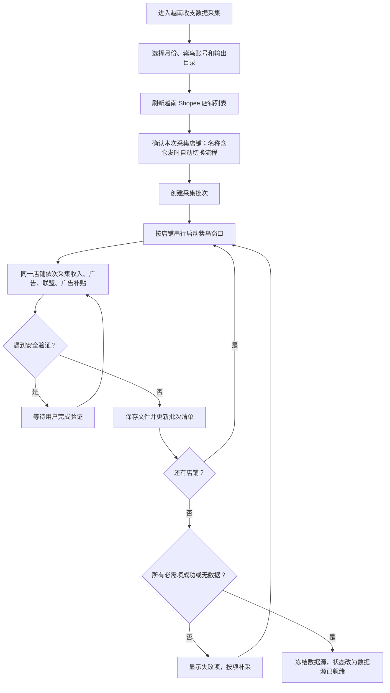

# 越南收支报表核对第一阶段：紫鸟数据拉取开发方案

## 1. 文档目的

本文只设计“越南 Shopee 收支报表核对”的第一阶段：通过紫鸟浏览器一次性拉取指定月份、指定店铺的全部 Shopee 原始数据，并将数据按批次落盘。

本阶段完成后，只保证数据源完整、可追踪、可补采，不进行运费、汇率、退款、利润等财务计算。后续文件处理必须基于本阶段冻结的原始数据运行，避免修改公式或重新生成报表时反复登录紫鸟。

原始需求来源：`C:\Users\Mayn\Desktop\越南收支报表核对.docx`。

## 2. 阶段目标

第一阶段交付一个独立的“越南收支数据采集”功能，支持：

1. 选择核对月份，默认上个月。
2. 使用桌面端已绑定的紫鸟账号获取店铺列表。
3. 只选择越南 Shopee 店铺，并维护普通店、仓发店类型。
4. 每个店铺窗口只启动一次，在同一会话内依次采集四类数据。
5. 实时展示每个店铺、每类数据的执行状态。
6. 遇到 Shopee 安全验证时暂停当前店铺，人工验证后继续。
7. 单项失败后只重试失败店铺、失败报表，不重复采集成功数据。
8. 每完成一项立即保存原始文件并更新 `manifest.json`。
9. 所有必需项成功或确认无数据后，将批次标记为“数据源已就绪”。
10. 程序退出或异常中断后，可以根据批次清单继续补采。

## 3. 本阶段不做的内容

以下功能明确放到后续阶段：

- 不导出马帮收支报表和退款报表。
- 不核对应收货款及订单数量。
- 不计算“运费-改”和“支出-包材费-改”。
- 不匹配补贴订单。
- 不计算汇率、退款、广告、联盟及利润。
- 不生成最终收支核对工作簿。
- 不把四类紫鸟数据合并成财务口径表。

本阶段只允许做保证原始数据可用所需的最小处理，例如文件命名、原始表头保留、行数统计、日期范围记录和文件完整性校验。

## 4. 需要采集的数据

每个目标店铺必须产生以下四类结果。结果可以是“成功文件”或经过确认的“无数据”，不能静默跳过。

| 数据类型 | 普通店入口 | 仓发店入口 | 日期口径 | 原始结果 |
| --- | --- | --- | --- | --- |
| 收入及补贴订单 `income` | My Income → Released | 我的收入 → 已完成拨款 → 拨款轮次 | 普通店按 Released 日期；仓发店按目标月份覆盖的拨款轮次及拨款日期 | 优先保存平台导出文件；无导出时保存原始分页 JSON/CSV |
| 广告消费 `ads` | Shopee Ads → All Ads Performance → Export Data | 相同 | 报表选择的日期范围 | 平台原始 CSV/XLSX |
| 联盟消费 `affiliate` | Affiliate Marketing Solution → Conversion Report → Export | 相同 | Order Time | 平台原始 CSV/XLSX |
| 广告补贴 `ads_credit` | Shopee Ads → My Account → Ads Wallet/Transaction History | 相同，仓发店增加补贴类型 | Transaction Date | 平台原始 CSV/XLSX |

广告补贴筛选项：

- 普通店：`Free Ads Credit ROAS Protection`、`Free Ads Credit Rebate`。
- 仓发店：在普通店基础上增加 `Technical Support Fee Ads Credit`。

### 4.1 原始数据保存原则

1. 平台能够导出文件时，保存平台原文件，不修改表头和单元格。
2. 平台只能分页展示时，完整遍历分页，保存页面返回的原始字段。
3. 为方便人工检查，可以额外生成 UTF-8 CSV，但不能替代原文件。
4. “无数据”必须记录筛选条件、页面结果数量和确认时间。
5. 失败时保存错误信息；必要时保存页面截图，但不得在日志中写入账号密码。

## 5. 用户操作流程



## 6. 前端设计

### 6.1 页面与导航

开发阶段保留独立页面，不接入驾驶舱和左侧导航。全部数据采集功能完成并通过真实环境验收后，再统一加入正式入口。

第一阶段页面只展示“数据采集”步骤，后续再增加“文件处理”和“核对结果”。

建议文件：

```text
frontend/pages/vietnam-income-reconciliation.html
frontend/assets/pages/vietnam-income-reconciliation.js
```

### 6.2 页面布局

```text
┌ 越南 Shopee 收支核对                              状态：待运行 ┐
│ 第一步：紫鸟数据采集                                            │
├───────────────────────────────────────────────────────────────┤
│ 核对月份 [2026-05]  紫鸟账号 [当前绑定账号]  输出目录 [选择]     │
│ 店铺范围 [全部越南店铺]  [刷新店铺]  [创建并开始采集]             │
├───────────────────────────────────────────────────────────────┤
│ 店铺总数 18   已完成 10   采集中 1   待验证 1   失败 1            │
├───────────────────────────────────────────────────────────────┤
│ 店铺名称           收入拨款    广告    联盟    广告补贴    操作    │
│ 店铺A                 ✓         ✓       ✓        ✓       [目录]  │
│ XX仓发店              ✓         ✓       ×        ✓       [重试]  │
│ 店铺C                待验证      —       —        —       [验证]  │
├───────────────────────────────────────────────────────────────┤
│ 当前任务：店铺C / 收入拨款                                     │
│ [打开店铺窗口] [我已完成验证，继续] [完成当前店铺后停止]          │
├───────────────────────────────────────────────────────────────┤
│ 运行日志                                                       │
└───────────────────────────────────────────────────────────────┘
```

### 6.3 页面输入

| 字段 | 规则 |
| --- | --- |
| 核对月份 | 默认上个月；自动换算起止日期 |
| 紫鸟账号 | 使用账号管理中当前绑定账号，不在页面显示密码 |
| 输出目录 | 默认使用应用全局输出目录 |
| 店铺范围 | 默认全部越南 Shopee 店铺，允许取消部分店铺 |
| 店铺类型 | 不在页面填写或显示；店铺名称包含“仓发”时自动识别为仓发店 |
| 数据类型 | 第一版固定四项全选，后续可支持单项补采 |
| 浏览器窗口 | 第一版固定正常显示，便于处理安全验证 |
| 并发数 | 第一版固定为 1，稳定后再评估增加到 2 |

### 6.4 单元格状态

店铺数据矩阵中的每个单元格单独维护状态：

- `pending`：未开始。
- `running`：正在采集。
- `waiting_verification`：等待用户在紫鸟窗口完成验证。
- `success`：已产生有效原始文件。
- `no_data`：筛选结果确认为零。
- `failed`：采集失败，可单独重试。
- `skipped`：用户主动跳过，不视为数据源完整。

只有所有必需单元格处于 `success` 或 `no_data`，页面才能显示“数据源已就绪”。

### 6.5 验证提示

检测到 Shopee 安全验证后，在页面顶部展示固定提示：

```text
店铺“XXX”需要完成 Shopee 安全验证。
请在已打开的紫鸟窗口中完成验证，然后点击继续。

[打开店铺窗口] [我已完成，继续] [跳过此店铺]
```

等待期间不得关闭当前店铺窗口，不得继续处理同一店铺的其他报表。

## 7. 后端设计

### 7.1 模块划分

```text
backend/core/ziniao_client.py
  紫鸟 HTTP IPC 客户端：启动客户端、获取店铺、启动/关闭窗口

backend/services/vietnam_income_collection.py
  批次目录、manifest、店铺类型判断和状态模型

backend/services/vietnam_income_subsidy.py
  Playwright 连接、普通店 Released 分页、仓发店拨款轮次和补贴订单导出

backend/services/vietnam_income_sources.py
  Shopee Ads 页面导出、联盟 Conversion Report 导出、广告钱包补贴流水采集

frontend/pages/vietnam-income-reconciliation.html
frontend/assets/pages/vietnam-income-reconciliation.js

tests/test_ziniao_client.py
tests/test_vietnam_income_collection.py
tests/test_vietnam_income_sources.py
```

紫鸟窗口管理和 Shopee 页面业务必须分层。`ziniao_client.py` 不应知道 My Income、广告或联盟页面；各 collector 也不应直接启动、退出紫鸟客户端。

### 7.2 紫鸟会话流程

1. 检查紫鸟客户端和 WebDriver 权限。
2. 以 WebDriver 模式启动紫鸟本地 HTTP 服务。
3. 调用 `updateCore` 确认内核就绪。
4. 调用 `getBrowserList` 获取店铺列表。
5. 根据站点及用户选择筛选越南 Shopee 店铺。
6. 对目标店铺调用 `startBrowser`，取得 `debuggingPort` 和 `core_version`。
7. 自动化框架连接 `127.0.0.1:{debuggingPort}`。
8. 在一个店铺会话中执行四类 collector。
9. 无论成功或失败，都在 `finally` 中调用 `stopBrowser`。
10. 全部店铺结束后退出紫鸟 WebDriver 客户端。

所有要求凭据的紫鸟接口都必须携带完整的 `company`、`username`、`password`。HTTP 响应统一按 UTF-8 解码，错误优先展示接口返回的 `err` 字段。

### 7.3 自动化框架决策

紫鸟窗口控制统一通过 HTTP IPC 完成，Shopee 页面操作统一使用 Playwright 的 `connect_over_cdp` 连接 `debuggingPort`。

桌面的 `ziniao_playwright_http_py3.py` 只作为紫鸟接口参考，不作为运行时依赖；正式代码不得硬编码桌面脚本路径。项目通过 `requirements.txt` 管理 Playwright 依赖，采集器只使用紫鸟返回的店铺浏览器内核，不额外启动 Playwright 自带浏览器。

普通店补贴订单使用地址规则：

```text
/portal/finance/income?type=2&dateRange=YYYYMMDDYYYYMMDD
```

并通过 `get_income_detail` 的游标分页读取；`adjustment_income_amount` 作为补贴金额。仓发店先确认当前子店区域为 `VN`，再读取 `get_available_payout_detail_list`，按 `payout_date` 选择目标月份的拨款轮次，通过 `payout_id` 分页读取明细。

广告消费必须从 Shopee Ads 页面触发平台导出，不使用聚合接口替代报表口径：

```text
/portal/marketing/pas/index?from={GMT+7月初时间戳}&to={GMT+7月末23:59:59时间戳}&type=new_cpc_homepage&group=custom
页面按钮：Export Data → Overall Ads Data
```

实现上允许使用导出任务状态接口等待平台生成文件，并使用平台返回的下载地址保存 CSV；这些接口只作为“页面导出任务的辅助状态/下载通道”，不是最终数据源。

联盟消费进入 `Affiliate Marketing Solution → Conversion Report` 提交平台导出任务，并到导出列表下载 `SellerConversionReport_*.csv`。广告补贴进入 Shopee Ads Wallet/Transaction History 拉取目标月份交易流水，额外生成候选广告补贴 CSV；普通店只筛 `Free Ads Credit ROAS Protection`、`Free Ads Credit Rebate`，仓发店额外筛 `Technical Support Fee Ads Credit`。

### 7.4 任务状态与断点

现有 `TaskManager` 只有 `pending/running/success/failed`，本功能至少需要增加：

- `waiting_user`：等待用户完成验证。
- `partial_success`：部分店铺或数据类型失败。
- `sources_ready`：全部紫鸟数据已准备完成。
- `cancelled`：用户要求在当前店铺结束后停止。

每完成一个数据单元格就立即写入清单，不应等全部店铺结束后一次性保存。应用重新启动后，读取清单即可恢复未完成项。

### 7.5 AppBridge 接口

建议新增以下接口：

```text
get_vietnam_collection_info()
  返回默认月份、输出目录、紫鸟路径和最近批次

create_vietnam_collection_run(payload)
  创建批次目录和 manifest；店铺类型由名称自动判断

start_vietnam_subsidy_collection(payload)
  采集收入拨款和补贴订单

start_vietnam_ziniao_sources_collection(payload)
  采集广告消费、联盟消费和广告补贴原始数据源

get_vietnam_collection_run(manifest_path)
  返回批次清单和店铺数据矩阵
```

启动参数示例：

```json
{
  "period": "2026-05",
  "start_date": "2026-05-01",
  "end_date": "2026-05-31",
  "store_names": ["店铺A", "店铺B"],
  "output_dir": "D:\\财务报表"
}
```

开发页面不接入驾驶舱，通过独立脚本启动：

```powershell
.\scripts\dev-vietnam-income.ps1
```

脚本仅改变本次桌面窗口的入口页，默认 `scripts/dev.ps1` 和正式驾驶舱入口保持不变。

紫鸟公司名、用户名和密码由 `AppBridge` 根据当前绑定账号注入，前端不得传递或回显保存的密码。

## 8. 文件落盘设计

### 8.1 目录结构

```text
{输出目录}/越南收支核对/{YYYY-MM}/{run_id}/
├─ manifest.json
├─ logs/
│  └─ collector.log
├─ screenshots/
│  └─ {店铺安全名}__{数据类型}__error.png
└─ raw/
   └─ ziniao/
      ├─ {店铺安全名A}/
      │  ├─ income/
      │  ├─ ads/
      │  ├─ affiliate/
      │  └─ ads_credit/
      └─ {店铺安全名B}/
```

文件名格式：

```text
{店铺安全名}__{数据类型}__{开始日期}_{结束日期}__{采集时间}.{扩展名}
```

店铺安全名只用于文件路径，`manifest.json` 中保留平台原始店铺名称。

### 8.2 manifest.json

```json
{
  "schema_version": 1,
  "run_id": "vn_202605_20260627_103000",
  "period": "2026-05",
  "start_date": "2026-05-01",
  "end_date": "2026-05-31",
  "status": "partial_success",
  "created_at": "2026-06-27 10:30:00",
  "updated_at": "2026-06-27 11:15:00",
  "stores": [
    {
      "store_name": "店铺A",
      "store_type": "normal",
      "reports": {
        "income": {
          "status": "success",
          "file": "raw/ziniao/店铺A/income/店铺A__income__20260501_20260531.xlsx",
          "row_count": 382,
          "retry_count": 0,
          "finished_at": "2026-06-27 10:42:00",
          "error_code": "",
          "error_message": ""
        }
      }
    }
  ]
}
```

清单中不得写入密码、Cookie、浏览器调试端口或完整紫鸟认证信息。

## 9. 错误处理

| 错误 | 处理方式 |
| --- | --- |
| 紫鸟客户端未安装或路径无效 | 启动前阻止任务，提示进入设置页面配置 |
| 紫鸟 WebDriver 权限未开通 | 终止批次并显示接口原始错误摘要 |
| 内核未就绪 | 轮询 `updateCore`，超时后失败 |
| 店铺未找到 | 该店铺标记失败，不影响其他店铺 |
| 店铺窗口启动失败 | 清理该窗口后重试一次，再标记失败 |
| 页面语言为中文/英文/越南文 | locator 使用稳定属性和多语言文本映射，不依赖单一显示文字 |
| Shopee 安全验证 | 状态改为 `waiting_verification`，等待用户继续 |
| 下载超时 | 保留页面和日志，当前报表可单独重试 |
| 文件为空或无法打开 | 不得标记成功，转为失败 |
| 应用异常退出 | 通过 `manifest.json` 恢复未完成项 |

禁止无提示地删除已有原始文件。重试产生新文件时保留旧文件，并由清单指向本次有效文件。

## 10. 分步开发顺序

### 10.1 里程碑 A：页面骨架与批次模型

- 新增独立开发页面，暂不接入驾驶舱导航。
- 完成月份、账号、输出目录和店铺表格布局。
- 实现批次目录与 `manifest.json` 数据结构。
- 使用模拟数据验证页面状态矩阵。

验收：可以创建批次、显示模拟店铺状态，并在磁盘生成合法清单。

### 10.2 里程碑 B：紫鸟连接与店铺列表

- 实现或整理 `ziniao_client.py`。
- 打通客户端启动、内核检查、获取店铺列表、启动和关闭单个店铺。
- 页面可以刷新并筛选越南 Shopee 店铺。
- 店铺名称包含“仓发”时自动识别为仓发店，不保存人工类型映射。

验收：能够从桌面端选择一个真实店铺，打开后再可靠关闭；失败不会残留失控窗口。

### 10.3 里程碑 C：单店收入数据

- 完成普通店 My Income → Released 的日期 URL、游标分页、原始 JSON 和补贴 CSV。
- 完成仓发店越南子店校验和“已完成拨款/拨款轮次”分页。
- 接入安全验证检测和人工继续。

验收：普通店和仓发店各选一个真实店铺，目标月份数据可完整落盘。

### 10.4 里程碑 D：单店另外三类数据

- 完成广告消费导出：进入 Shopee Ads 页面，点击 `Export Data → Overall Ads Data`，保存平台 CSV。
- 完成联盟 Conversion Report 导出：提交平台导出任务，保存 `SellerConversionReport_*.csv`。
- 完成广告补贴导出及店铺类型差异：普通店筛两类 Free Ads Credit，仓发店额外筛 Technical Support Fee Ads Credit。

验收：单个店铺只启动一次窗口，能够依次获得四类数据；其中一项失败不破坏其他已下载文件。

### 10.5 里程碑 E：多店批量与补采

- 多店串行采集。
- 状态矩阵实时刷新。
- 支持指定单元格重试。
- 支持完成当前店铺后停止。
- 支持应用重启后的批次恢复。

验收：全部目标店铺完成后状态为 `sources_ready`；人为制造单项失败后可以只补采该项。

### 10.6 里程碑 F：打包与真实环境验收

- 验证 PyInstaller 包含所需驱动、自动化依赖及静态页面。
- 验证普通用户安装路径和输出目录权限。
- 验证长时间运行、验证码、多语言页面及网络波动。
- 完成用户操作说明。

## 11. 验收标准

第一阶段只有同时满足以下条件才算完成：

1. 用户不需要打开或运行桌面上的 Python 脚本。
2. 用户可以从应用选择月份和越南 Shopee 店铺。
3. 普通店与仓发店使用各自正确的收入数据入口。
4. 每个店铺在一次窗口会话中处理四类数据。
5. 所有原始文件按批次、店铺、数据类型保存。
6. `manifest.json` 能准确描述每个单元格的状态、文件和行数。
7. 验证码完成后能够继续当前任务。
8. 单项失败可以单独补采，不覆盖其他成功文件。
9. 应用重启后能够识别未完成批次。
10. 清单无失败、等待或跳过项时，批次自动进入 `sources_ready`。
11. 日志、文件和错误信息中不包含账号密码。
12. 打包后的安装版可以在财务人员电脑上独立运行。

## 12. 开发前需要确认的业务项

以下内容不阻塞页面骨架和紫鸟连接开发，但必须在对应 collector 开发前确认：

1. 越南 Shopee 的完整目标店铺名单；仓发店由名称中的“仓发”自动识别。
2. 仓发店当前按 `payout_date` 归属月份，如财务口径改为订单日期需调整。
3. 普通店收入页面是否存在稳定的原生导出；如果没有，确认允许保存分页抓取结果。
4. 广告、联盟和广告补贴下载文件的真实格式、编码及多语言表头。
5. 四类数据是否对所有店铺都必需，还是部分店铺允许配置为“不适用”。
6. Shopee 安全验证由用户手工完成，还是后续接入现有打码服务。

第一版按“Playwright、单店串行、四类数据全部必需”实施。补贴订单采集已完成普通店和仓发店真实数据探查及端到端文件验证；安全验证无法自动通过时仍需进入等待人工验证状态。
