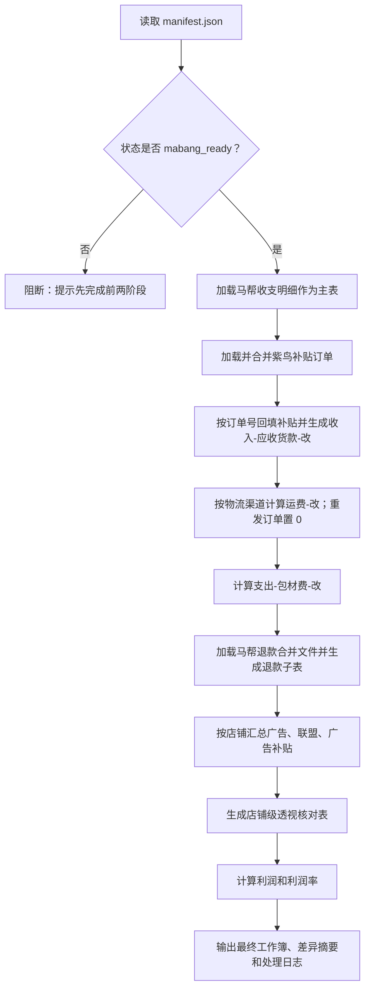

# 越南收支报表核对第三阶段：最终文件处理开发方案

## 1. 阶段定位

第三阶段只做离线文件处理：读取第一阶段紫鸟数据源和第二阶段马帮数据源，生成最终收支核对工作簿、差异摘要和处理日志。

本阶段不再登录紫鸟或马帮，不重新导出平台数据，不覆盖前两阶段落盘的原始 CSV/XLSX 文件。所有加工结果都写入新的输出目录或工作簿，确保原始数据可追溯。

## 2. 前置条件

只有批次状态达到 `mabang_ready` 后才允许进入第三阶段。具体要求：

1. 紫鸟四类数据源完成：收入拨款/补贴订单、广告消费、联盟消费、广告补贴。
2. 马帮收支明细和收支汇总完成，订单数与应收货款校验通过。
3. 马帮退款三段导出完成，并生成去重后的退款合并文件。
4. `manifest.json` 中所有必需文件路径存在，且状态不是 `failed`。

## 3. 输入数据

| 来源 | 数据 | 用途 |
| --- | --- | --- |
| 马帮 | 收支明细 CSV | 最终核对主表 |
| 马帮 | 收支汇总 CSV + 校验 JSON | 阻断式校验和人工复核 |
| 马帮 | 退款合并 CSV | 生成“退款”子表并计算实际退款金额 |
| 紫鸟 | 补贴订单 | 生成“补贴订单”子表，并按订单号回填主表 |
| 紫鸟 | 广告消费 | 按店铺汇总广告 expense |
| 紫鸟 | 联盟消费 | 按店铺汇总联盟 expense |
| 紫鸟 | 广告补贴 | 按店铺汇总广告补贴 expense |

## 4. 已确认的业务口径

以下口径已确认并进入第一版开发：

1. 物流渠道单价从 `物流渠道` 文本中提取，例如 `SPX Express (VN胡志明自建仓)-15元/KG` 提取为 `15`。
2. 物流渠道没有出现 `N元/KG` 时，默认按 `10 元/KG` 计算。
3. 上月利润率在页面手动填写，每个店铺一行。
4. 退款公式固定加数 `4` 按每个店铺计算一次。
5. 汇率平均值使用收支明细全表平均汇率。
6. 最终利润里的“所有”代表所有支出项。
7. 紫鸟店铺名称与马帮店铺名称第一版先做精确匹配和包含匹配；未匹配项进入 `未匹配清单`，不静默丢弃。

## 5. 核心处理流程



## 6. 主表新增列

| 新增列 | 位置 | 公式/逻辑 |
| --- | --- | --- |
| `运费-改` | `预估运费` 右侧 | `订单重量 / 1000 * 从物流渠道提取的 N元/KG；缺失按 10` |
| `收入-应收货款-改` | `收入-应收货款` 附近 | `收入-应收货款 + 补贴 * 全表平均汇率` |
| `支出-包材费-改` | `支出-包材费` 右侧 | `支出-包材费 * 销量` |

特殊规则：订单编号以 `_1` 结尾时识别为重发订单，`运费-改` 改为 `0`。

## 7. 子表处理

### 7.1 补贴订单

1. 将紫鸟采集到的所有补贴订单合并到子表 `补贴订单`。
2. 做中英文表头标准化，保留原始字段。
3. 按订单号匹配回马帮收支明细。
4. 未匹配订单进入差异清单。

### 7.2 退款

1. 将马帮 `refunds_merged` 写入子表 `退款`。
2. 新增 `实际退款金额RMB`。
3. 退款行先按店铺利润率计算：`退款金额RMB * 上月利润率`。
4. 固定加数 `4` 按店铺只加一次；第一版在退款子表中增加 `店铺固定加数`，同店铺首条退款记 `4`，其余记 `0`。
5. `实际退款金额RMB = 退款金额RMB * 上月利润率 + 店铺固定加数`。

### 7.3 广告、联盟和广告补贴

按店铺汇总各数据源中的 `expense`：

| 指标 | 计算 |
| --- | --- |
| `广告` | 每店广告消费 `expense` 求和 |
| `实际广告` | `广告 * 汇率 / 0.92` |
| `联盟` | 每店联盟消费 `expense` 求和 |
| `实际联盟` | `联盟 * 汇率 / 0.92` |
| `广告补贴` | 每店广告补贴 `expense` 求和 |
| `实际广告补贴` | `广告补贴 * 汇率 / 0.92` |
| `最终广告花费` | `实际广告 - 实际广告补贴` |

## 8. 最终核对表

最终核对表建议按店铺生成透视汇总：

1. 从处理后的收支明细按 `店铺名称` 汇总。
2. 匹配 `退款` 子表中的 `实际退款金额RMB`。
3. 匹配店铺级 `实际联盟`。
4. 匹配店铺级 `最终广告花费`。
5. 追加 `利润` 和 `利润率`。

第一版利润公式：

```text
利润 = 收入-应收货款-改 - 所有支出项 - 实际退款金额RMB - 实际联盟 - 最终广告花费
利润率 = 利润 / 收入-应收货款-改
```

`所有支出项` 使用所有原始 `支出-` 字段汇总，并以 `运费-改`、`支出-包材费-改` 替代对应调整项参与汇总。

## 9. 输出文件

建议输出到：

```text
{run_dir}/output/final/
```

文件包括：

1. `越南Shopee收支核对_{YYYY-MM}.xlsx`
2. `final_reconciliation_summary.json`
3. `unmatched_records.csv`
4. `processing_log.json`

## 10. 前端设计

页面第三阶段先展示为“最终文件处理”区块：

1. 数据源前置：读取 manifest 判断是否达到 `mabang_ready`。
2. 业务配置：展示待确认配置项，不在页面隐藏。
3. 输出文件：展示未来会生成的工作簿、差异摘要和日志。
4. 上月利润率输入：页面提供多行文本框，格式为 `店铺名称=利润率`。
5. 生成按钮：只有数据源达到 `mabang_ready` 且上月利润率不为空时可点击。

后续第三阶段实现后，再将按钮接入后端：

```text
start_vietnam_final_reconciliation(payload)
```

payload 第一版只需要：

```json
{
  "manifest_path": "D:\\越南收支核对\\2026-05\\vn_xxx\\manifest.json",
  "profit_rates_text": "张三-越南001=12.5%\n李四-越南仓发002=0.08"
}
```

## 11. 验收标准

第三阶段完成后需要满足：

1. 不重新导出紫鸟或马帮数据。
2. 原始文件只读，所有加工结果另存。
3. 缺少业务配置时阻断并明确提示缺哪一项。
4. 补贴订单、退款、广告、联盟和广告补贴均可追溯到原始文件。
5. 未匹配记录可单独查看。
6. 公式列位置与原始需求一致。
7. 最终 Excel 打开无损坏、表头清晰、公式或数值口径可复核。
