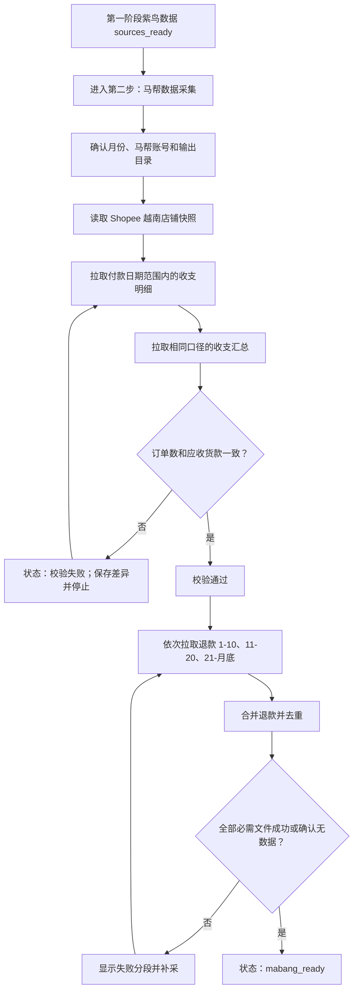

# 越南收支报表核对第二阶段：马帮数据拉取开发方案

## 1. 文档目的

本文设计“越南 Shopee 收支报表核对”的第二阶段：在第一阶段紫鸟四类数据源完成后，从马帮 ERP 拉取指定月份的收支明细、收支汇总和退款明细，并完成收支明细的阻断式校验。

本阶段只负责马帮原始数据获取、文件落盘、完整性校验和断点补采，不修改收支明细，不写入补贴、广告、联盟、退款公式，也不生成最终核对工作簿。

原始需求来源：`C:\Users\Mayn\Desktop\越南收支报表核对.docx`。

第一阶段方案：`docs/越南收支报表核对第一阶段_紫鸟数据拉取开发方案.md`。

## 2. 前置条件

开始第二阶段前必须满足：

1. 已创建越南收支核对批次，批次月份和起止日期已冻结。
2. 第一阶段紫鸟数据状态为 `sources_ready`。
3. 桌面端已经绑定可用的马帮账号。
4. 本阶段复用第一阶段的 `run_id` 和批次目录，不新建另一套月份目录。
5. 开发阶段仍使用独立页面，不接入驾驶舱和正式左侧导航。

第一版不允许绕过第一阶段直接运行马帮阶段，避免不同批次、不同月份的数据混在一起。

## 3. 阶段目标

第二阶段交付以下能力：

1. 使用桌面端已绑定的马帮账号登录，不在前端传递或显示密码。
2. 读取同一批次的月份，默认不允许在第二阶段单独修改日期。
3. 动态识别全部 Shopee 越南店铺，避免只依赖历史固定店铺标签。
4. 按“付款日期”拉取整月收支明细。
5. 按相同店铺、日期、平台和币种拉取收支汇总。
6. 校验订单数和应收货款；校验失败立即停止后续马帮流程。
7. 按退款时间分三段拉取退款明细并合并。
8. 每个原始分段文件、合并文件和校验结果都写入 `manifest.json`。
9. 重复运行时跳过已经成功且文件仍存在的数据源。
10. 中断后可以只补采失败的收支、汇总或退款分段。
11. 全部必需项完成且收支校验通过后，将批次标记为 `mabang_ready`。

## 4. 本阶段不做的内容

以下内容放到第三阶段“最终文件处理”：

- 不计算“运费-改”。
- 不处理订单号以 `_1` 结尾的重发订单运费。
- 不创建“补贴订单”子表。
- 不将紫鸟补贴匹配回马帮收支明细。
- 不计算“收入-应收货款-改”。
- 不计算“实际退款金额RMB”。
- 不将广告、联盟、广告补贴写入退款子表。
- 不计算“实际广告”“实际联盟”“最终广告花费”。
- 不计算“支出-包材费-改”。
- 不生成透视表、利润和利润率。
- 不读取驾驶舱数据，也不向驾驶舱写入运行结果。

本阶段可以生成用于人工核验的汇总 CSV/JSON，但不得改变马帮返回的原始财务字段。

## 5. 马帮数据源清单

第二阶段包含三个逻辑数据源，其中收支明细和退款明细需要落盘为原始文件，收支汇总作为校验快照保存。

| 数据源 | 标识 | 马帮入口/接口 | 日期口径 | 输出 |
| --- | --- | --- | --- | --- |
| 收支明细 | `income_detail` | 报表 → 销售报告 → 收支报表；`reports.getIncomePayParticularsData` | 付款日期 | 完整明细 CSV + 原始元数据 JSON |
| 收支汇总 | `income_summary` | 收支报表按店铺/国家汇总；`reports.getIncomePayData` | 付款日期 | 店铺汇总 CSV + 请求/校验 JSON |
| 退款明细 | `refunds` | 报表 → 退款报表 → 退款列表 → 高级搜索 | 退款时间 | 3 个原始分段文件 + 1 个合并 CSV |

广告消费、联盟消费、广告补贴和 Shopee 收入拨款已经由第一阶段紫鸟流程提供，第二阶段不得从马帮重复生成替代数据。

## 6. 统一业务口径

### 6.1 日期范围

第二阶段直接使用批次清单中的：

```text
period
start_date
end_date
```

例如批次月份为 `2026-05`：

```text
开始：2026-05-01 00:00:00
结束：2026-05-31 23:59:59
```

收支明细和收支汇总必须使用“付款日期”；退款明细必须使用“退款时间”。

不得将“付款日期”替换成发货日期、创建日期或结算日期。

### 6.2 平台和国家

固定条件：

```text
平台：Shopee
马帮平台 ID：17
国家/地区：越南（VN）
```

店铺范围优先通过马帮实时店铺列表取得：

1. 查询平台 ID 为 `17` 的店铺。
2. 根据店铺国家字段筛选 `VN`；如果接口不返回国家字段，再根据店铺名称中的“越南”或稳定配置映射筛选。
3. 保存本次店铺快照，包括 `shop_id`、`shop_name`、平台和筛选原因。
4. 历史自定义标签 `shopee越南` 只作为兼容回退，不能成为唯一来源。

### 6.3 币种

主计算口径固定为人民币：

```text
moneyType=RMB
```

收支明细中的 `收入-应收货款` 与收支汇总的应收货款必须使用相同币种后再比较。

原始币种、`应收货款(原始货币)` 和汇率仍完整保留，供第三阶段计算。若需要复核原需求截图中的 USD 数值，可以额外保存 USD 汇总快照，但 USD 快照不替代 RMB 阻断校验。

### 6.4 分页

马帮收支明细第一版每页请求 `2000` 条：

```text
rowsPerPage=2000
```

先请求第 1 页并解析总页数，再分页拉取剩余数据。并发数第一版限制为 `4`，通过真实环境稳定性验证后最多提高到 `7`。

所有分页必须记录页码、返回行数和累计行数。任一中间页失败时不能使用不完整文件标记成功。

## 7. 收支明细采集设计

### 7.1 可复用代码

现有参考实现：

```text
D:\hqyl_project\mabang_process\base\收支报表下载.py
```

可复用内容：

- `reports.getIncomePayParticularsData` 接口。
- `exportData` 数据解析。
- `pageHtml` 总页数解析。
- 英文字段到中文字段的映射。
- 每页 2000 条和分页合并逻辑。

正式桌面端代码不得运行或导入网络共享目录中的脚本，也不得依赖网络共享目录中的 formdata 文本。需要使用的字段和请求构造逻辑应迁移到当前项目并添加测试。

### 7.2 必须修正的旧逻辑

旧脚本当前覆盖：

```text
expresstimeTimeStart
expresstimeTimeEnd
```

这代表发货日期，与本业务要求不一致。第二阶段必须改为：

```text
paytimeTimeStart={start_date} 00:00:00
paytimeTimeEnd={end_date} 23:59:59
expresstimeTimeStart=
expresstimeTimeEnd=
```

同时固定：

```text
platformId[]=17
moneyType=RMB
page=1..N
rowsPerPage=2000
```

不得直接复制旧 formdata 中过期的日期和固定店铺标签。

### 7.3 字段要求

平台返回的原始字段应尽量完整保存。最终 CSV 至少包含以下字段：

```text
订单编号
交易号
结算状态
店铺名称
站点
国家
订单业务模式
商品名称
平台sku*数量
付款日期
发货日期
创建时间
结算时间
订单重量
计量重量
仓库
物流公司
物流渠道
货运单号
内部单号
平台
原始币种
应收货款(原始货币)
汇率
订单备注
收入-应收货款
收入-应收邮资
收入-其他收入
收入-退货成本
收入-运费退回
收入-补贴金额
收入-小计
支出-成本
预估运费
实际运费
支出-转帐费
支出-平台费
支出-交易手续费
支出-佣金
支出-服务费
支出-广告费
支出-包材费
支出-头程费
支出-FBA费用
支出-优惠券
支出-VAT税费
支出-其他费用
支出-其他支出
支出-测评费
支出-小计
退款金额
销量
退货数量
退货入库数量
商品种类
毛利
毛利率
是否重发订单
平台订单状态
```

如果平台未返回某个非关键字段，可以保存空列；以下关键字段缺失时文件必须标记失败：

```text
订单编号
店铺名称
付款日期
收入-应收货款
汇率
订单重量
物流渠道
预估运费
支出-包材费
销量
```

### 7.4 文件成功条件

收支明细只有同时满足以下条件才能标记 `success`：

1. 所有分页请求成功。
2. CSV 可以重新打开。
3. 关键字段全部存在。
4. 不包含“合计”伪数据行。
5. 每条有效记录有订单编号。
6. 文件大小大于零。
7. 记录数和去重订单数已经写入清单。

若查询确认为零条，状态标记为 `no_data`，但越南 Shopee 月度批次默认将零条视为异常并提示人工确认。

## 8. 收支汇总与阻断校验

### 8.1 汇总请求

收支汇总使用：

```text
reports.getIncomePayData
```

请求条件必须与明细完全一致：

```text
searchType=shop
timeType=paytime
moneyType=RMB
platformId[]=17
shopIdMultiple[]=本次越南 Shopee 店铺ID
dayDateStart={start_date}
dayDateEnd={end_date}
```

返回表格至少解析：

```text
店铺ID/店铺名称
totalNum（订单数）
itemTotal（应收货款）
incomeTotal（收入小计，仅留档，不用于应收货款校验）
```

同时保存马帮页面显示的数据更新时间和本次请求的非敏感筛选条件。

### 8.2 校验规则

按店铺和总计分别进行校验：

```text
明细订单数 = 收支明细中“订单编号”的去重数量
汇总订单数 = 汇总接口 totalNum 求和

明细应收货款 = 收支明细“收入-应收货款”求和
汇总应收货款 = 汇总接口 itemTotal 求和
```

数值使用 `Decimal` 计算，禁止使用二进制浮点直接求和。

判定规则：

```text
订单数差异必须为 0
应收货款绝对差异必须 <= 0.01 RMB
```

### 8.3 校验结果

校验结果保存为：

```json
{
  "status": "passed",
  "currency": "RMB",
  "date_type": "paytime",
  "detail_row_count": 12500,
  "detail_order_count": 12460,
  "summary_order_count": 12460,
  "detail_receivable": "845221.37",
  "summary_receivable": "845221.37",
  "order_count_diff": 0,
  "receivable_diff": "0.00",
  "store_mismatches": []
}
```

若总计不一致，继续输出按店铺差异，帮助定位漏店、日期口径或币种错误。

### 8.4 阻断规则

校验失败时：

1. 批次状态改为 `mabang_validation_failed`。
2. 保存明细文件、汇总快照和差异报告，不删除证据。
3. 页面显示不一致的店铺、订单数差异和金额差异。
4. 禁止启动退款采集和第三阶段文件处理。
5. 修复筛选条件后只重跑收支明细与汇总校验。

第一版不提供“忽略差异继续”按钮。

## 9. 退款明细采集设计

### 9.1 固定筛选条件

入口：

```text
报表 → 退款报表 → 退款列表 → 高级搜索
```

固定条件：

```text
平台：Shopee
国家：越南
退款订单状态：已发货
时间字段：退款时间
```

### 9.2 日期分段

由于整月一次导出可能失败，固定拆成三段：

| 分段 | 开始日期 | 结束日期 |
| --- | --- | --- |
| `part_01_10` | 当月 1 日 00:00:00 | 当月 10 日 23:59:59 |
| `part_11_20` | 当月 11 日 00:00:00 | 当月 20 日 23:59:59 |
| `part_21_end` | 当月 21 日 00:00:00 | 当月最后一日 23:59:59 |

每段单独维护状态和文件。第二次运行只重试缺失或失败的分段。

### 9.3 已确认的页面导出链路

当前项目中的马帮客户端存在按订单查询退款记录的接口，但它不等同于“退款报表 → 退款列表”的批量报表口径。

已使用真实马帮账号完成页面与网络请求探查，确认：

- 退款列表位于独立数据窗口，搜索请求为 `paypal.dosearchpaypalrefund`。
- 页面高级搜索字段为 `platformId=17`、`countryCodes[]=VN`、`orderStatus[]=3`、`refundTimeStart` 和 `refundTimeEnd`。
- `17`、`VN`、`3` 分别表示 Shopee、越南、已发货。
- 每段先执行高级搜索，再调用页面“导出搜索的全部记录 → 单行导出”。
- 页面同步导出上限为 50,000 条；超过时任务明确失败，不静默截断。
- 导出格式为 UTF-8 BOM CSV，包含“退款金额RMB”。

不得在未验证的情况下假定退款报表接口路径，也不得用逐订单退款查询替代批量退款报表。

### 9.4 退款字段

原始结果至少保留：

```text
订单编号
平台订单号
退款单编号
店铺ID
店铺名称
平台
国家
退款时间
退款订单状态
退款状态
退款原因
退款金额
退款币种
退款金额RMB
创建退款时订单状态
```

优先使用导出文件中的“退款单编号”；该字段缺失时使用以下字段组成去重键：

```text
订单编号 + 退款时间 + 退款金额RMB + 退款原因
```

不能只按订单编号去重，因为同一订单可能存在多次退款。

### 9.5 分段合并

三段全部完成后生成 `refunds_merged`：

1. 保留三个原始分段文件，不覆盖。
2. 统一表头和数据类型。
3. 按退款单编号或组合键去重。
4. 按退款时间、订单编号排序。
5. 记录每段行数、合并前行数、重复数和合并后行数。

退款确认为零条时允许标记 `no_data`，并生成包含筛选条件的元数据 JSON。

## 10. 用户操作流程



## 11. 前端设计

### 11.1 页面位置

继续使用：

```text
frontend/pages/vietnam-income-reconciliation.html
frontend/assets/pages/vietnam-income-reconciliation.js
```

在现有第一阶段下方增加“第二步：马帮数据采集”，开发完成前不接正式导航。

### 11.2 页面布局

```text
┌ 第二步：马帮数据采集                         状态：待运行 ┐
│ 核对月份 [2026-05，只读]  马帮账号 [当前绑定账号]          │
│ 前置状态：紫鸟数据已就绪 ✓                                 │
├───────────────────────────────────────────────────────────┤
│ Shopee 越南店铺       118 家     [刷新店铺快照]             │
│ 收支明细              待运行     [开始导出并校验]           │
│ 收支汇总              待运行                                  │
│ 校验结果              —                                      │
├───────────────────────────────────────────────────────────┤
│ 退款 01-10            待运行                                  │
│ 退款 11-20            待运行                                  │
│ 退款 21-月底          待运行                                  │
│ 退款合并              待运行     [开始退款采集]             │
├───────────────────────────────────────────────────────────┤
│ 订单数：明细 12460 / 汇总 12460 / 差异 0                    │
│ 应收货款：明细 ¥845221.37 / 汇总 ¥845221.37 / 差异 ¥0.00    │
│ [打开批次目录] [重试失败项]                                 │
├───────────────────────────────────────────────────────────┤
│ 运行日志                                                   │
└───────────────────────────────────────────────────────────┘
```

### 11.3 页面规则

| 项目 | 规则 |
| --- | --- |
| 月份 | 从批次读取，只读 |
| 马帮账号 | 使用账号管理中当前绑定账号，不显示密码 |
| 输出目录 | 继承第一阶段批次目录，只读 |
| 店铺类型 | 第二阶段不展示普通店/仓发店类型 |
| 收支按钮 | 第一阶段完成且马帮账号有效时可用 |
| 退款按钮 | 只有收支校验通过后可用 |
| 重试 | 只重试失败或文件缺失的项 |
| 继续下一阶段 | 只有状态为 `mabang_ready` 时可用 |

## 12. 后端设计

### 12.1 模块划分

建议新增：

```text
backend/services/vietnam_mabang_collection.py
  第二阶段任务编排、manifest 状态、断点和文件目录

backend/services/vietnam_mabang_income.py
  店铺快照、收支明细分页、字段映射、汇总查询和阻断校验

backend/services/vietnam_mabang_refunds.py
  退款报表探查后的分段查询、原始落盘、合并和去重

tests/test_vietnam_mabang_collection.py
tests/test_vietnam_mabang_income.py
tests/test_vietnam_mabang_refunds.py
```

扩展：

```text
backend/core/mabang_client.py
  增加通用已登录 POST、店铺列表、收支明细、收支汇总和退款报表请求能力
```

`mabang_client.py` 只负责登录、会话和 HTTP 请求；字段映射、业务筛选、金额校验和文件命名必须放在对应 service 中。

### 12.2 账号和会话

1. `AppBridge` 根据当前绑定的 `mabang` 账号注入用户名和密码。
2. 后端建立一个 `MabangClient` 会话并完成登录。
3. 收支明细、汇总和退款在同一任务中复用登录会话。
4. 请求失败如果确认是登录失效，只允许自动重新登录一次。
5. 任务结束后关闭 HTTP 客户端。

密码、Cookie、CSRF 值和完整请求头不得写入 manifest、日志或元数据文件。

### 12.3 AppBridge 接口

建议新增：

```text
get_vietnam_mabang_info(manifest_path)
  返回前置状态、月份、马帮账号、已有文件和校验结果

start_vietnam_mabang_income_collection(payload)
  拉取店铺快照、收支明细、汇总并执行阻断校验

start_vietnam_mabang_refund_collection(payload)
  校验通过后拉取三个退款分段并合并

retry_vietnam_mabang_item(payload)
  只重试指定失败数据项
```

请求示例：

```json
{
  "manifest_path": "D:\\越南收支核对\\2026-05\\vn_202605_xxx\\manifest.json",
  "account_id": "当前绑定马帮账号ID"
}
```

前端不得重复传入日期、店铺类型或账号密码。

## 13. 文件落盘设计

### 13.1 目录结构

在第一阶段批次目录中增加：

```text
{run_dir}/
├─ manifest.json
├─ raw/
│  ├─ ziniao/
│  └─ mabang/
│     ├─ shops/
│     │  └─ shopee_vietnam_shop_snapshot__{采集时间}.json
│     ├─ income_detail/
│     │  ├─ mabang_income_detail__{开始日期}_{结束日期}__{采集时间}.csv
│     │  └─ income_detail_meta__{采集时间}.json
│     ├─ income_summary/
│     │  ├─ mabang_income_summary_rmb__{开始日期}_{结束日期}__{采集时间}.csv
│     │  └─ income_validation__{采集时间}.json
│     └─ refunds/
│        ├─ refund_part_01_10__{开始日期}_{结束日期}__{采集时间}.csv
│        ├─ refund_part_11_20__{开始日期}_{结束日期}__{采集时间}.csv
│        ├─ refund_part_21_end__{开始日期}_{结束日期}__{采集时间}.csv
│        ├─ refunds_merged__{开始日期}_{结束日期}__{采集时间}.csv
│        └─ refunds_merge_meta__{采集时间}.json
└─ logs/
   └─ collector.log
```

原始分段文件不能被合并文件替代。重试生成新文件时保留旧文件，由 manifest 指向最新有效文件。

### 13.2 manifest 扩展

为兼容第一阶段已经创建的批次，第一版继续使用 `schema_version: 1`，新增可选的顶层 `mabang` 节点，不修改已有 `stores[].reports`。

```json
{
  "schema_version": 1,
  "run_id": "vn_202605_20260629_155040_83c67a",
  "period": "2026-05",
  "status": "mabang_ready",
  "mabang": {
    "status": "ready",
    "shop_snapshot_file": "raw/mabang/shops/shopee_vietnam_shop_snapshot.json",
    "reports": {
      "income_detail": {
        "status": "success",
        "file": "raw/mabang/income_detail/mabang_income_detail.csv",
        "row_count": 12500,
        "order_count": 12460,
        "retry_count": 0,
        "error_message": ""
      },
      "income_summary": {
        "status": "success",
        "file": "raw/mabang/income_summary/mabang_income_summary_rmb.csv",
        "row_count": 118
      },
      "refund_part_01_10": {
        "status": "success",
        "file": "raw/mabang/refunds/refund_part_01_10.csv",
        "row_count": 76
      },
      "refund_part_11_20": {
        "status": "success",
        "file": "raw/mabang/refunds/refund_part_11_20.csv",
        "row_count": 81
      },
      "refund_part_21_end": {
        "status": "success",
        "file": "raw/mabang/refunds/refund_part_21_end.csv",
        "row_count": 92
      },
      "refunds_merged": {
        "status": "success",
        "file": "raw/mabang/refunds/refunds_merged.csv",
        "row_count": 247,
        "duplicate_count": 2
      }
    },
    "validation": {
      "status": "passed",
      "file": "raw/mabang/income_summary/income_validation.json",
      "order_count_diff": 0,
      "receivable_diff": "0.00"
    }
  }
}
```

### 13.3 状态定义

报表项继续使用：

```text
pending
running
success
no_data
failed
```

第二阶段批次状态增加：

```text
mabang_collecting
mabang_validation_failed
mabang_refunds_collecting
mabang_ready
```

只有以下条件同时成立才进入 `mabang_ready`：

1. 收支明细为 `success`。
2. 收支汇总为 `success`。
3. 收支校验为 `passed`。
4. 三个退款分段均为 `success` 或确认后的 `no_data`。
5. 退款合并文件为 `success`，或者三段全部无数据时为 `no_data`。

## 14. 断点和重复运行

### 14.1 完成判定

一个数据项只有满足以下条件才视为已完成：

- 状态为 `success` 且 manifest 指向的文件真实存在；或
- 状态为 `no_data` 且保存了本次查询条件和确认时间。

收支阶段还要求 `validation.status == passed`。仅有收支文件但校验失败时不得跳过校验。

### 14.2 重试策略

| 项目 | 重试行为 |
| --- | --- |
| 店铺快照失败 | 重新登录并重试一次 |
| 收支某分页失败 | 当前收支文件整体失败，下一次重新拉取全部分页 |
| 汇总失败 | 保留已成功收支文件，只重跑汇总和校验 |
| 校验不一致 | 不自动重复请求；展示差异并等待修复口径 |
| 单个退款分段失败 | 只重跑该分段 |
| 退款合并失败 | 不重拉原始分段，只重新合并 |

第二次点击运行时不得再次导出已经成功且文件存在的报表。

## 15. 错误处理

| 错误 | 处理方式 |
| --- | --- |
| 未绑定马帮账号 | 启动前阻止并提示到账号管理绑定 |
| 登录失败 | 任务失败，不记录密码或响应 Cookie |
| 登录会话失效 | 自动重新登录一次，再失败则停止 |
| 越南 Shopee 店铺列表为空 | 阻止运行，保存筛选摘要 |
| 分页总数无法解析 | 以空页终止策略继续，但设置最大页数保护 |
| 中间页请求失败 | 收支项标记失败，不生成成功文件 |
| 关键字段缺失 | 文件标记失败并列出缺失字段 |
| 收支校验不一致 | 状态改为 `mabang_validation_failed` 并停止 |
| 退款某分段失败 | 其他成功分段保留，该分段可单独重试 |
| 退款重复记录 | 合并时按稳定退款键去重并记录数量 |
| 文件无法重新打开 | 不得标记成功 |
| 应用异常退出 | 从 manifest 恢复未完成项 |

日志可以记录接口名称、页码、状态码和错误摘要，但禁止记录完整表单、账号密码、Cookie 和令牌。

## 16. 分步开发顺序

### 16.1 里程碑 A：第二阶段页面与 manifest 模型

- 在独立开发页增加第二阶段卡片。
- 展示第一阶段前置状态、月份、马帮账号和输出目录。
- 扩展 manifest 的 `mabang` 节点。
- 使用模拟数据展示收支、校验和三个退款分段状态。

验收：旧的第一阶段 manifest 可以正常打开；创建第二阶段状态后不破坏紫鸟结果。

### 16.2 里程碑 B：马帮登录和店铺快照

- 扩展当前项目的 `MabangClient`。
- 使用桌面端绑定账号登录。
- 获取 Shopee 平台店铺并筛选越南店铺。
- 保存店铺 ID/名称快照。

验收：真实账号可以稳定返回越南 Shopee 店铺，密码和 Cookie 不落盘。

### 16.3 里程碑 C：收支明细

- 迁移 `getIncomePayParticularsData` 分页逻辑和字段映射。
- 将日期字段改为 `paytimeTimeStart/paytimeTimeEnd`。
- 固定平台、越南店铺和 RMB 口径。
- 保存原始明细 CSV 和元数据。

验收：指定月份收支明细完整落盘，关键字段齐全，分页行数可追踪。

### 16.4 里程碑 D：汇总与阻断校验

- 实现 `getIncomePayData` 汇总请求。
- 解析每店铺 `totalNum`、`itemTotal` 和 `incomeTotal`，其中 `itemTotal` 用作应收货款。
- 用 `Decimal` 按店铺和总计校验。
- 页面显示差异，失败时阻断。

验收：真实月份订单数差异为 0、应收货款差异不超过 0.01 RMB；人为修改明细后校验能够失败。

### 16.5 里程碑 E：退款报表探查与三段采集

- 在真实马帮退款报表页面确认接口和筛选编码。
- 实现三个日期分段。
- 保存每个原始分段。
- 合并、去重并生成元数据。

验收：三个分段可独立运行和重试，合并行数关系正确，同一订单多次退款不会被错误删除。

### 16.6 里程碑 F：恢复、打包和真实环境验收

- 验证中断恢复和重复运行跳过。
- 验证网络波动、登录失效和大月份分页。
- 验证打包版包含所需解析依赖。
- 普通店与仓发店数据均包含在马帮店铺范围内。

验收：一个真实月份完整运行后状态为 `mabang_ready`，第二次运行不重复导出。

## 17. 测试设计

### 17.1 单元测试

至少覆盖：

1. 上个月起止日期和月底天数。
2. 收支请求使用付款日期而非发货日期。
3. Shopee 平台 ID 固定为 `17`。
4. RMB 币种在明细和汇总请求中一致。
5. 第 1 页总页数解析和空页终止。
6. 英文字段到中文字段映射。
7. 合计行和空订单号过滤。
8. `Decimal` 金额求和和 0.01 容差。
9. 明细订单号去重计数。
10. 按店铺生成差异列表。
11. 退款三段日期边界，包括 2 月和闰年。
12. 退款单编号/组合键去重。
13. 已成功文件存在时跳过。
14. 状态成功但文件缺失时重新采集。
15. manifest 中不出现密码或 Cookie。

### 17.2 集成测试

使用模拟 HTTP 响应覆盖：

- 收支多页全部成功。
- 收支中间页失败。
- 汇总订单数不一致。
- 汇总金额不一致。
- 登录过期后重新登录成功。
- 退款某一分段失败后单独重试。
- 三个退款分段存在边界重复记录。

### 17.3 真实环境冒烟

至少选一个目标月份执行：

1. 拉取全部 Shopee 越南店铺快照。
2. 完成收支明细和汇总校验。
3. 人工核对马帮页面显示的总订单数和应收货款。
4. 完成三个退款分段并核对页面总记录数。
5. 再运行一次，确认所有成功项均跳过。

## 18. 验收标准

第二阶段只有同时满足以下条件才算完成：

1. 用户不需要运行 `mabang_process` 中的脚本或准备 formdata 文件。
2. 月份、平台、国家、币种和日期字段均由程序固定为正确口径。
3. 使用付款日期获取完整收支明细。
4. 使用相同口径获取收支汇总。
5. 明细去重订单数与汇总订单数一致。
6. 明细应收货款与汇总应收货款差异不超过 0.01 RMB。
7. 校验失败能够阻断退款和第三阶段处理。
8. 退款按三个日期区间完整获取。
9. 同一订单的多次真实退款不会被误删。
10. 所有原始文件、分段文件、合并文件和校验结果均可追踪。
11. 单项失败可独立重试，成功项不会重复导出。
12. 应用重启后可以恢复未完成批次。
13. manifest、日志和输出文件不包含账号密码或 Cookie。
14. 完成后批次状态准确进入 `mabang_ready`。
15. 开发完成前不接入驾驶舱。

## 19. 第三阶段前仍需准备的业务配置

以下不是第二阶段马帮数据源，但第三阶段处理文件前必须提供：

1. 完整的越南物流渠道每公斤单价映射，例如 `VN胡志明自建仓 -> 4元/kg`。
2. 紫鸟店铺名称与马帮店铺名称/ID的匹配规则。
3. “上月利润率”的来源、粒度和缺失处理方式。
4. 退款公式中的固定加数 `4` 是否按每条退款、每个订单还是每个店铺计算。
5. 汇率平均值是全表平均、按店铺平均还是按币种平均。

这些配置不阻塞第二阶段原始数据拉取，但未确认前不得开始最终财务公式处理。
